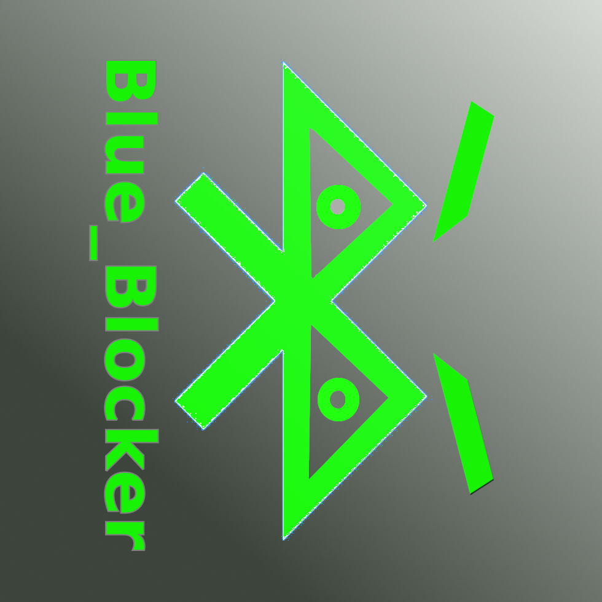

  

### blue_blocker
# ESP32 & Dual nRF24L01 2.4GHz Signal Tester / Jammer

This project explores the vulnerability of the 2.4GHz spectrum (commonly used by Bluetooth and Wi-Fi) against continuous carrier waves. The system utilizes an ESP32-WROOM-32E and two nRF24L01+ modules to transmit raw signals across multiple frequencies in rapid succession.

> ⚠️ **Legal Disclaimer:** This project is strictly for educational, research, and testing purposes inside a controlled environment (e.g., a Faraday cage). Operating RF jamming equipment is illegal in many jurisdictions without proper authorization. The creator assumes no liability for any misuse, interference, or damage caused by this project.

---

## 🛠️ Hardware & Specifications

To ensure optimal performance and reliable frequency generation, the following components and hardware tweaks were implemented:

* **Microcontroller:** ESP32-WROOM-32E
* **RF Modules:** 2x nRF24L01+ equipped with external **SMA rubber duck antennas** for improved range.
* **Power Supply Stability:** Because the nRF24L01 modules experience high current spikes at maximum output power (`RF24_PA_MAX`), a **100 µF capacitor** was soldered directly across the VCC (3.3V) and GND pins of each module. This prevents voltage drops and MCU brownouts.

---

## 📈 Testing & Empirical Limitations

The setup was evaluated against modern consumer hardware, specifically an iPhone 15 and Sony wireless headphones. 

### Key Findings & Limitations:
1. **Ineffective Against Modern Bluetooth Standards:** This project is **not** capable of completely severing connections or dropping packets entirely on newer Bluetooth hardware. 
2. **Audio Stuttering Only:** Testing with a *JBL Go 2* speaker and *Sony headphones* showed that the music playback does not stop. It only experiences **mild to moderate stuttering/choppiness**. Modern Adaptive Frequency Hopping (AFH) protocols mitigate the carrier interference quite effectively.
3. **Range & Orientation:** 
   * A maximum effective range of **up to 10 meters** was achieved. However, this only works if the target device is moved **slowly** away from the modules.
   * Line-of-sight and height matter significantly: Elevating the transmitter modules **higher off the ground** noticeably improves the interference effect.

---

## 📌 Pin Configuration (Wiring)

The two modules run simultaneously using the ESP32's independent dual SPI buses (VSPI and HSPI):

| nRF24L01 Module 1 (VSPI) | ESP32 Pin | | nRF24L01 Module 2 (HSPI) | ESP32 Pin |
| :--- | :--- | :--- | :--- | :--- |
| **VCC** | 3.3V (with Cap) | | **VCC** | 3.3V (with Cap) |
| **GND** | GND | | **GND** | GND |
| **CE** | GPIO 22 | | **CE** | GPIO 16 |
| **CSN** | GPIO 21 | | **CSN** | GPIO 15 |
| **SCK** | GPIO 18 | | **SCK** | GPIO 14 |
| **MISO** | GPIO 19 | | **MISO** | GPIO 12 |
| **MOSI** | GPIO 23 | | **MOSI** | GPIO 13 |

---

## 🚀 Installation

1. Install the **RF24 library** by TMRh20 via the Arduino Library Manager or your PlatformIO environment.
2. Wire your hardware according to the pinout table above.
3. Upload the source code found in the `src/` directory to your ESP32.
4. Open the Serial Monitor at **115200 Baud** to verify startup routines.
